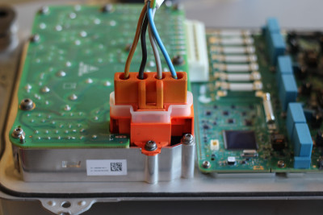

# 3D Printable **Tesla Model 3 PCS** Connectors

3D printable parts to connect up the Tesla Model 3 PCS designed by openinverter.org community member [_muehlpower_](https://openinverter.org/forum/viewtopic.php?f=10&t=171&start=50#p7765)  

   

   

3D Prints via an online print service like https://i.materialise.com/de are around *15€** ($16.50) each.  

To be useful, each plug must be fitted with conductors terminated with the corresponding crimp connectors.  

Crimp connector information:  
  
• Connectors for **400V** conductors are `Uni F630` from [MTA](http://www.mta.it/flex/TemplatesUSR/assets/pdf/MtaCatalogo_Product_Catalogue.pdf), part number `1107940`.  
• Connectors for **12V** conductors are [Kostal](https://www.kostal.com/en-gb/innovation/hv-batteriemodulverbinder) [PLK 14.5](https://www.ttiinc.com/content/ttiinc/en/manufacturers/k-o/kostal/products/KOSTAL-PLK-14-5-high-voltage-connector.html), part number `23124734300`.   
• Connectors for data lines are [TE connectivity, part number 1318774-1](https://www.te.com/usa-en/product-1318774-1.html) for white or [1318774-2](https://www.te.com/usa-en/product-1318774-2.html) for black.  

The author of these files stated the following at the time of their release:  

*I have no idea about licenses, but everyone can do what they want with the files. I am not responsible for any damage and do not guarantee any function.*  
